# Kiến Trúc End-to-End: SHuBERT ASL → English Realtime

> [!IMPORTANT]
> Tài liệu này mô tả kiến trúc hoạt động **toàn bộ hệ thống từ đầu đến cuối**, focus vào preset mặc định **`split_mp2_cpu10`** với **2 MediaPipe raw worker**.

---

## 1. Tổng Quan Hệ Thống

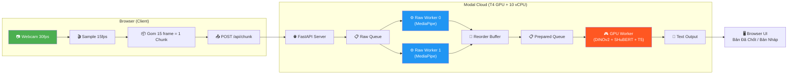

---

## 2. Kiến Trúc Deployment

### 2.1 Modal Container

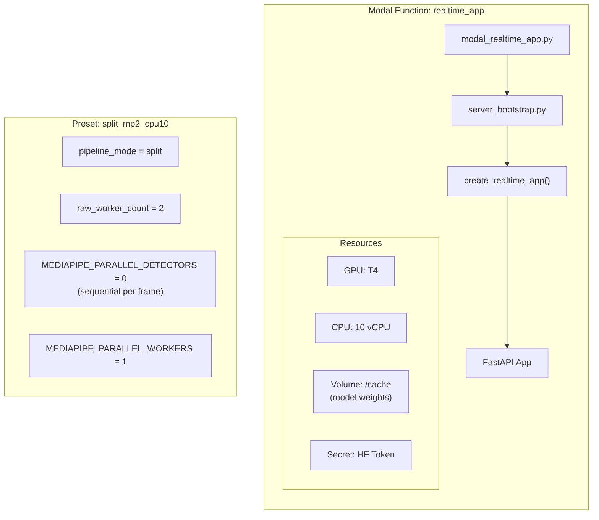

| Thông số | Giá trị |
|---|---|
| **Image** | `debian_slim` + Python 3.10 + PyTorch 2.2.0 (cu118) |
| **GPU** | NVIDIA T4 (16GB VRAM) |
| **CPU** | 10 vCPU |
| **Min/Max Containers** | 1/1 |
| **Timeout** | 900s |
| **Startup Timeout** | 1200s |
| **Scaledown Window** | 900s |

### 2.2 Startup Warmup Sequence

Khi container khởi động, hệ thống chạy **background warmup** để load tất cả model trước khi nhận request:

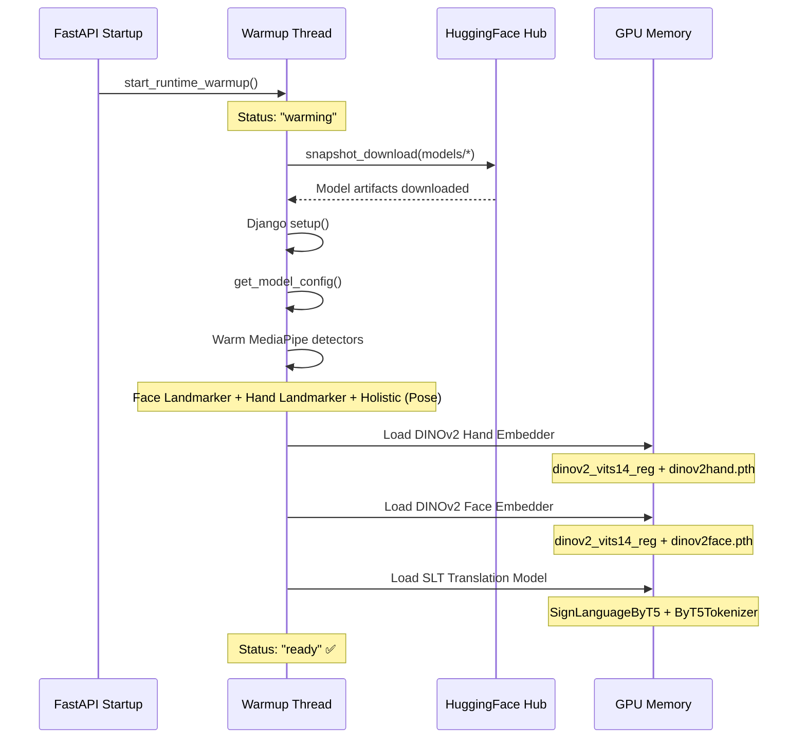

**Model artifacts trên Volume `/cache`:**

| Model | File | Device | Mô tả |
|---|---|---|---|
| MediaPipe Face | `face_landmarker_v2_with_blendshapes.task` | CPU | Phát hiện 478 face landmarks |
| MediaPipe Hand | `hand_landmarker.task` | CPU | Phát hiện 21 hand landmarks × 2 tay |
| MediaPipe Pose | Built-in Holistic | CPU | 33 pose landmarks |
| DINOv2 Hand | `dinov2hand.pth` | GPU | ViT-S/14 fine-tuned, output 384-dim |
| DINOv2 Face | `dinov2face.pth` | GPU | ViT-S/14 fine-tuned, output 384-dim |
| SHuBERT | `checkpoint_836_400000.pt` | GPU | SignHuBERT encoder (768-dim repr) |
| SLT ByT5 | `checkpoint-11625/` | GPU | ByT5-base conditional generation |
| Tokenizer | `byt5_base/` | CPU | ByT5Tokenizer (byte-level) |

---

## 3. Browser Client Flow

### 3.1 Capture Pipeline

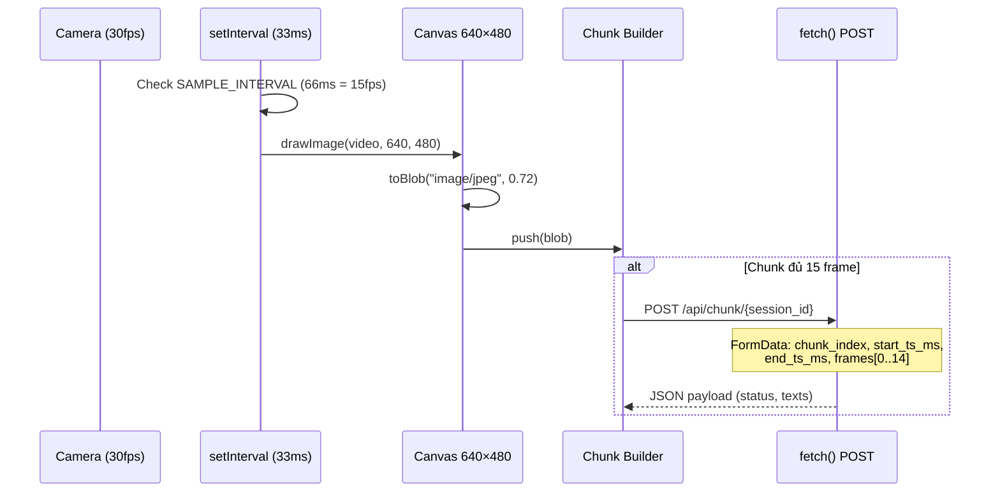

| Thông số Browser | Giá trị |
|---|---|
| Camera FPS | 30 |
| Sample FPS | 15 (lấy mẫu cách 66ms) |
| Frame size | 640 × 480 |
| JPEG quality | 0.72 |
| Frames per chunk | 15 |
| Chunk interval | ~1 giây |

### 3.2 Session Lifecycle

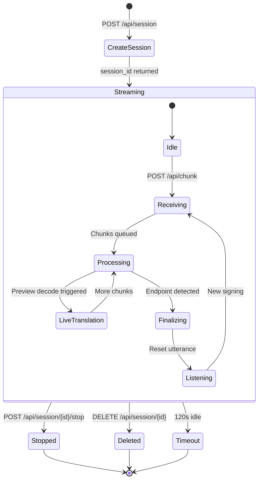

---

## 4. Split Pipeline Architecture (Core)

> [!NOTE]
> Đây là phần **quan trọng nhất** của kiến trúc. Preset `split_mp2_cpu10` tách pipeline thành **2 giai đoạn song song**: CPU-bound MediaPipe (2 worker) và GPU-bound inference (1 worker).

### 4.1 Thread Architecture

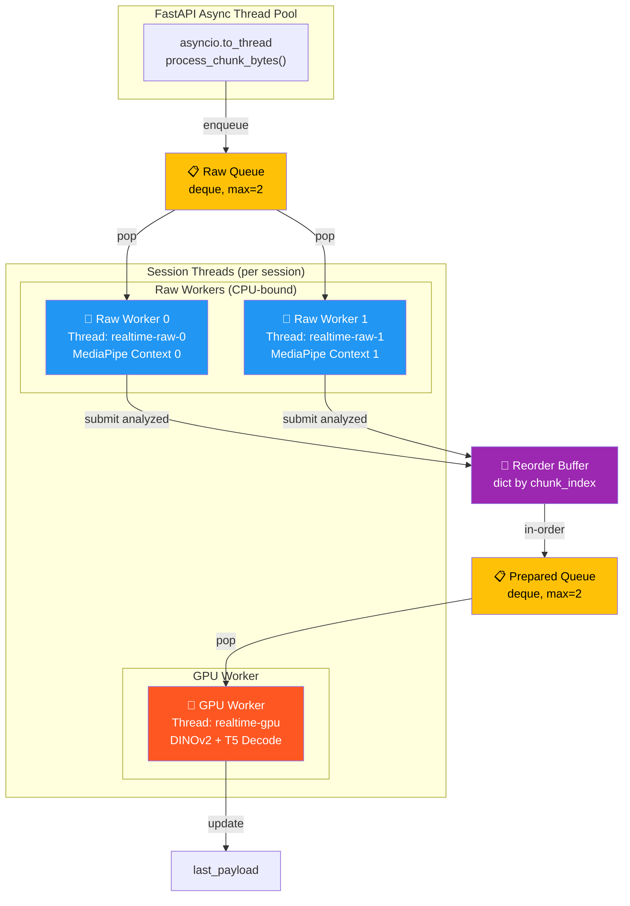

### 4.2 Tại sao 2 Worker + Reorder Buffer?

| Vấn đề | Giải pháp |
|---|---|
| MediaPipe chạy sequential trên CPU, mỗi frame ~25-40ms | 2 worker xử lý 2 chunk **song song** trên 2 CPU thread |
| GPU worker nhanh hơn CPU worker → GPU đói data | 2 worker cung cấp đủ data cho GPU liên tục |
| Out-of-order processing phá hỏng endpoint detection | **Reorder Buffer** (`_analyzed_chunks_by_index`) đảm bảo chunk vào prepared queue **đúng thứ tự** |
| Quá nhiều chunk backlog → latency tăng | Bounded queues (`chunk_queue_max=2`, `prepared_queue_max=2`) + coalesce khi đầy |

### 4.3 Chi Tiết Hoạt Động Từng Thread

#### Thread: FastAPI Ingest (asyncio)

```python
# ws_server.py - process_chunk endpoint
POST /api/chunk/{session_id}
  ├── Parse FormData (chunk_index, timestamps, JPEG frames)
  ├── asyncio.to_thread(session.process_chunk_bytes)
  │   ├── Normalize frame bytes
  │   ├── Lock _raw_queue_condition
  │   ├── if raw_queue >= chunk_queue_max:  # Backpressure!
  │   │   └── raw_queue[-1].extend(pending_chunk)  # Coalesce
  │   ├── else:
  │   │   └── raw_queue.append(pending_chunk)
  │   ├── notify() → wake raw worker
  │   └── return snapshot of last_payload
  └── record_ingest_metrics()
```

#### Thread: Raw Worker 0 & 1 (CPU-bound MediaPipe)

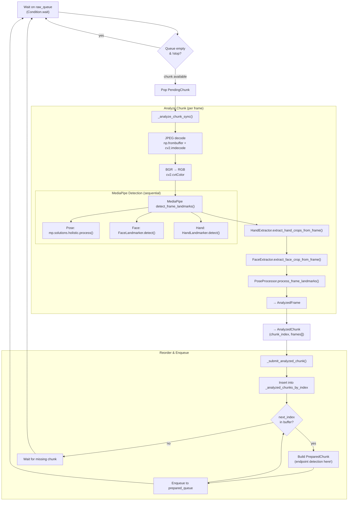

> [!WARNING]
> **Endpoint detection** (`EndpointDetector.update()`) chạy **TRONG reorder phase** (`_build_prepared_chunk_from_analyzed`), KHÔNG phải trong raw worker. Điều này đảm bảo endpoint detection luôn nhận frame theo **đúng thứ tự thời gian**, dù 2 worker xử lý chunk nào trước.

#### Thread: GPU Worker (inference-bound)

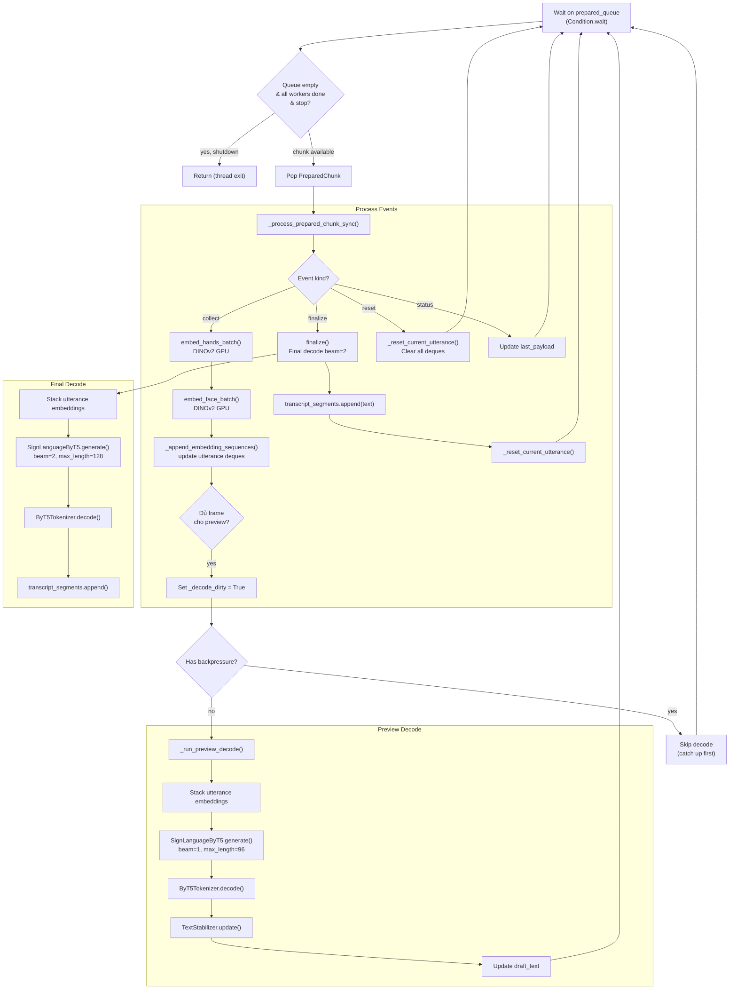

---

## 5. Data Transformations (Chi Tiết)

### 5.1 Pipeline Dữ Liệu Theo Từng Stage

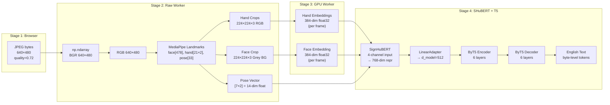

### 5.2 Feature Dimensions

| Stage | Data | Dimension | Notes |
|---|---|---|---|
| JPEG Input | Raw frame | 640×480×3 uint8 | JPEG quality 72% |
| MediaPipe Face | Landmarks | 478 × [x,y,z] | Normalized [0,1] |
| MediaPipe Hand | Landmarks | 21 × [x,y,z] × 2 hands | Wrist matching by pose |
| MediaPipe Pose | Landmarks | 33 × [x,y,z] | Used indices: [0,11,12,13,14,15,16] |
| Left Hand Crop | RGB image | 224×224×3 uint8 | Bounding box + scale 1.5 |
| Right Hand Crop | RGB image | 224×224×3 uint8 | Bounding box + scale 1.5 |
| Face Crop | Grey BG image | 224×224×3 uint8 | Eyes + mouth only on grey |
| Pose Embedding | Float vector | 14 float32 | 7 keypoints × 2 (x,y), normalized |
| DINOv2 Hand Emb | Float vector | 384 float32 | ViT-S/14 dinov2_vits14_reg |
| DINOv2 Face Emb | Float vector | 384 float32 | ViT-S/14 dinov2_vits14_reg |
| SHuBERT Input | 4-channel | [T, 384+384+384+14] | Concatenated channels |
| SHuBERT Output | Representations | [T, 768] × 12 layers | Weighted sum → 768-dim |
| LinearAdapter | Projected | [T, 512] | Match ByT5 d_model |
| ByT5 Output | Token IDs | Variable length | Byte-level tokenization |

---

## 6. Queue Mechanics

### 6.1 Raw Queue

```
┌─────────────────────────────────────────────────────────┐
│  Raw Queue  (deque, max=2)                              │
│                                                         │
│  Producer: FastAPI ingest thread                        │
│  Consumer: Raw Worker 0, Raw Worker 1                   │
│  Lock: _raw_queue_condition (RLock + Condition)         │
│                                                         │
│  ┌──────────┐    ┌──────────┐                          │
│  │ Chunk #N │    │ Chunk #M │    (← slots)             │
│  └──────────┘    └──────────┘                          │
│                                                         │
│  Backpressure: Khi queue đầy (≥2 chunks),              │
│  chunk mới được COALESCE vào chunk cuối                 │
│  (extend frame_bytes_list)                              │
│                                                         │
│  Kết quả: chunk bị gộp sẽ có nhiều frame hơn 15,      │
│  nhưng tránh mất data hoàn toàn                        │
└─────────────────────────────────────────────────────────┘
```

### 6.2 Reorder Buffer (Multi-worker Only)

```
┌─────────────────────────────────────────────────────────┐
│  Reorder Buffer  (dict: chunk_index → AnalyzedChunk)    │
│                                                         │
│  Vấn đề: Worker 0 xử lý chunk #5, Worker 1 xử lý     │
│  chunk #4. Worker 1 xong trước → chunk #5 đến trước #4 │
│                                                         │
│  Giải pháp: _next_analyzed_chunk_index = 4              │
│                                                         │
│  Buffer state: { 5: AnalyzedChunk#5 }                  │
│  → Chunk #5 chờ, vì #4 chưa có                        │
│                                                         │
│  Worker 0 xong chunk #4:                                │
│  Buffer state: { 4: AnalyzedChunk#4, 5: AC#5 }        │
│  → Pop #4, build PreparedChunk, enqueue                │
│  → Pop #5, build PreparedChunk, enqueue                │
│  → _next_analyzed_chunk_index = 6                       │
│                                                         │
│  KEY: Endpoint detection chạy ở đây, trong             │
│  _build_prepared_chunk_from_analyzed(), đảm bảo         │
│  frame order chính xác                                  │
└─────────────────────────────────────────────────────────┘
```

### 6.3 Prepared Queue

```
┌─────────────────────────────────────────────────────────┐
│  Prepared Queue  (deque, max=2)                         │
│                                                         │
│  Producer: Raw Workers (sau reorder)                    │
│  Consumer: GPU Worker (duy nhất 1 thread)               │
│  Lock: _prepared_queue_condition                        │
│                                                         │
│  ┌────────────────┐    ┌────────────────┐              │
│  │ PreparedChunk  │    │ PreparedChunk  │              │
│  │ events: [      │    │ events: [      │              │
│  │   collect,     │    │   collect,     │              │
│  │   status,      │    │   finalize,    │              │
│  │   collect      │    │   reset        │              │
│  │ ]              │    │ ]              │              │
│  └────────────────┘    └────────────────┘              │
│                                                         │
│  Backpressure: Raw worker BLOCK (wait) khi             │
│  prepared queue đầy (≥2). Không coalesce.              │
│                                                         │
│  GPU Worker exit condition:                             │
│  prepared_queue empty AND worker_should_stop            │
│  AND raw_queue empty AND raw_workers_active==0          │
│  AND analyzed_chunks_by_index empty                     │
└─────────────────────────────────────────────────────────┘
```

---

## 7. Endpoint Detection

Endpoint detection quyết định khi nào một câu ký hiệu **kết thúc** để trigger final decode.

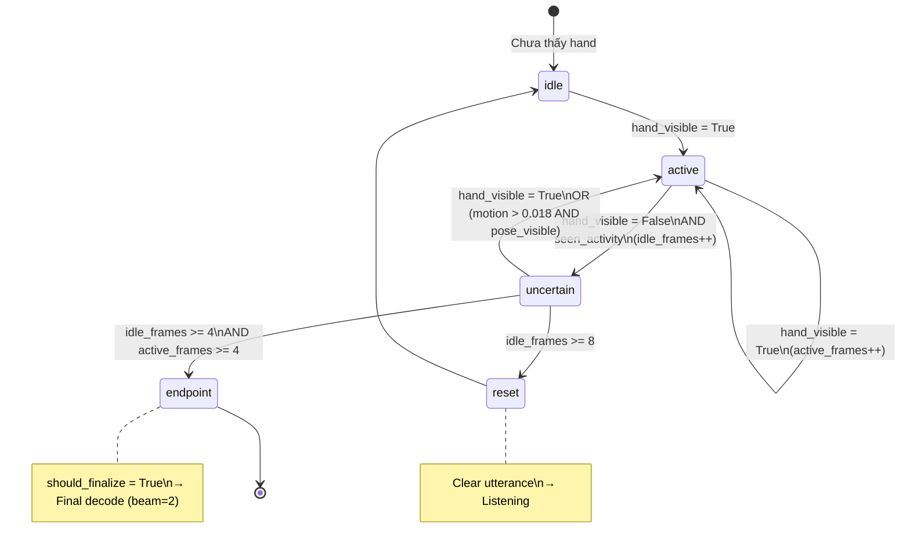

| Tham số | Giá trị | Ý nghĩa |
|---|---|---|
| `endpoint_idle_frames` | 4 | Số frame liên tiếp không thấy hand → finalize |
| `endpoint_reset_frames` | 8 | Số frame không thấy hand → reset hoàn toàn |
| `endpoint_min_active_frames` | 4 | Tối thiểu frames có hand trước khi finalize |
| `endpoint_motion_threshold` | 0.018 | Ngưỡng motion energy để duy trì continuity |

---

## 8. Preview vs Final Decode

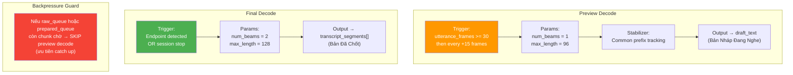

### Text Stabilizer

Class `TextStabilizer` giữ 2 buffer:
- **`_previous_tokens`**: Hypothesis lần trước
- **`_stable_tokens`**: Common prefix ổn định qua nhiều decode

Logic: Chỉ hiển thị text khi nó lặp lại ổn định → tránh flickering trên UI.

---

## 9. Shared Runtime & Lock Strategy

### 9.1 SharedRealtimeRuntime

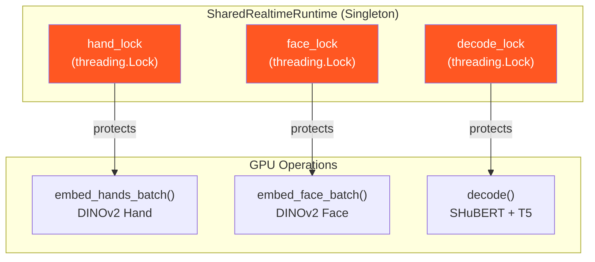

> [!TIP]
> Mỗi GPU operation có **lock riêng**. Trong thực tế, chỉ có **1 GPU worker** nên không có contention. Nhưng lock vẫn cần thiết vì `decode()` được gọi từ cả GPU worker thread lẫn `finalize()` thread.

### 9.2 Session State Lock

```
_state_lock (RLock)
├── _raw_queue_condition (Condition using _state_lock)
│   ├── Producer: FastAPI ingest → notify()
│   └── Consumer: Raw Workers → wait()
│
└── _prepared_queue_condition (Condition using _state_lock)
    ├── Producer: Raw Workers (sau reorder) → notify_all()
    └── Consumer: GPU Worker → wait()
```

---

## 10. Sequence Diagram End-to-End

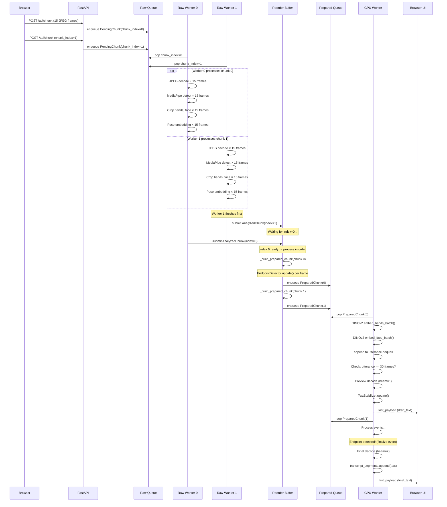

---

## 11. Cấu Trúc File Quan Trọng

```
OpenSLT/
├── modal_realtime_app.py          # Modal deployment entry point
│                                   # Preset selection, image build, T4 GPU
│
├── realtime/
│   ├── server_bootstrap.py        # create_modal_web_app() wrapper
│   ├── config.py                  # RealtimeConfig dataclass (all tuning params)
│   ├── ws_server.py               # FastAPI app, HTTP endpoints, browser HTML/JS
│   ├── session.py                 # RealtimeSession: queues, workers, pipeline
│   ├── runtime.py                 # SharedRealtimeRuntime: model warmup & locks
│   ├── endpoint.py                # EndpointDetector: utterance boundary FSM
│   ├── text_stabilizer.py         # TextStabilizer: draft text flickering guard
│   └── benchmark_modal_compare.py # Official benchmark: mp2 vs sota
│
├── ai_core/
│   ├── kpe_mediapipe.py           # HolisticDetector: Face+Hand+Pose detection
│   ├── crop_hands.py              # HandExtractor: hand crop from landmarks
│   ├── crop_face.py               # FaceExtractor: face cue crop (eyes+mouth)
│   ├── body_features.py           # PoseProcessor: pose keypoint normalization
│   ├── dinov2_features.py         # DINOEmbedder: ViT-S/14 embedding extraction
│   ├── inference.py               # SignLanguageByT5: SHuBERT + T5 generation
│   └── shubert.py                 # SignHubertModel: multi-channel encoder
│
├── sign_translation_engine/
│   └── runtime/
│       └── bootstrap.py           # HF model download, cache setup, config
│
└── config/
    └── settings.py                # Django settings (DB, cache, HF token)
```

---

## 12. Tham Số Cấu Hình Chính

### Preset: `split_mp2_cpu10`

| Nhóm | Tham số | Giá trị | Mô tả |
|---|---|---|---|
| **Pipeline** | `pipeline_mode` | `split` | Tách CPU/GPU workers |
| **Pipeline** | `raw_worker_count` | `2` | ← **Core: 2 MP workers** |
| **MediaPipe** | `PARALLEL_DETECTORS` | `0` (off) | Pose/Face/Hand chạy sequential per frame |
| **MediaPipe** | `PARALLEL_WORKERS` | `1` | ThreadPool per detector = 1 |
| **Camera** | `camera_input_fps` | `30` | Camera hardware FPS |
| **Camera** | `target_fps` | `15` | Browser sampling FPS |
| **Camera** | `frame_width × height` | `640 × 480` | Frame resolution |
| **Chunk** | `chunk_frames` | `15` | Frames per chunk (~1s) |
| **Queue** | `chunk_queue_max` | `2` | Raw queue bound |
| **Queue** | `prepared_queue_max` | `2` | Prepared queue bound |
| **Utterance** | `recent_window_frames` | `16` | Sliding window for recent embeddings |
| **Utterance** | `max_utterance_frames` | `128` | Max frames per utterance (~8.5s) |
| **Preview** | `preview_initial_frames` | `30` | First decode at 30 frames (~2s) |
| **Preview** | `preview_stride_frames` | `15` | Decode every +15 frames |
| **Preview** | `preview_num_beams` | `1` | Greedy decode for speed |
| **Final** | `final_num_beams` | `2` | Beam search for quality |
| **Final** | `final_max_length` | `128` | Max output tokens |
| **Endpoint** | `endpoint_idle_frames` | `4` | Frames without hand → finalize |
| **Endpoint** | `endpoint_reset_frames` | `8` | Frames without hand → reset |
| **Session** | `session_idle_timeout_ms` | `120000` | Auto-cleanup after 2 min idle |

---

## 13. Bottleneck Analysis

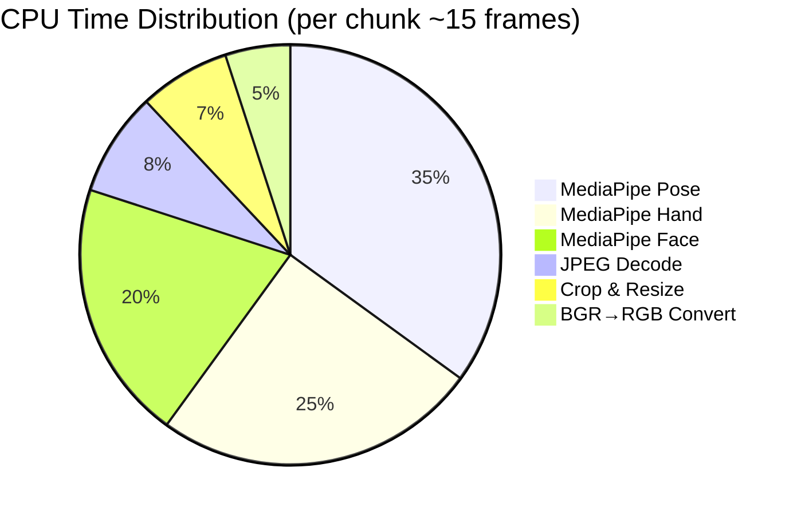

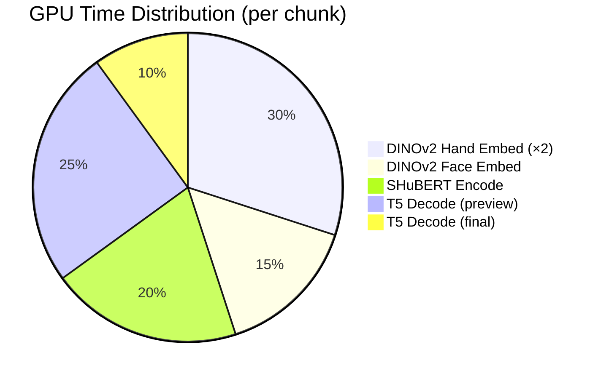

> [!IMPORTANT]
> **Bottleneck chính** nằm ở CPU MediaPipe detection (~80% CPU time). Đó là lý do **2 raw workers** hiệu quả: trong khi Worker 0 đang detect frame, Worker 1 detect chunk khác → tổng throughput tăng gần **2x** (giới hạn bởi GIL release trong C++ MediaPipe backend).

---

## 14. Tóm Tắt Flow Hoàn Chỉnh

```
📷 Camera 30fps
    ↓ (browser sample 15fps)
📦 15 frames → 1 chunk JPEG
    ↓ (HTTP POST)
🌐 FastAPI parse FormData
    ↓ (enqueue)
📋 Raw Queue [max=2, coalesce khi đầy]
    ↓ (2 workers cạnh tranh pop)
⚙️ Raw Worker 0 ──┬── JPEG decode
⚙️ Raw Worker 1 ──┘   BGR→RGB
                       MediaPipe (Pose+Face+Hand sequential)
                       Crop hands 224×224
                       Crop face 224×224 (eyes+mouth on grey)
                       Pose vector 14-dim
    ↓ (submit to reorder buffer)
🔄 Reorder Buffer [dict by chunk_index]
    ↓ (drain in-order, run endpoint detection)
📋 Prepared Queue [max=2, block khi đầy]
    ↓ (GPU worker pop)
🎮 GPU Worker
    ├── DINOv2 embed hands → 384-dim × 2
    ├── DINOv2 embed face → 384-dim
    ├── Append to utterance deques
    ├── [Preview] SHuBERT → T5 beam=1 → draft_text
    └── [Final]   SHuBERT → T5 beam=2 → final_text
    ↓
📝 last_payload {status, draft_text, final_text}
    ↓ (HTTP response / next chunk response)
🖥️ Browser UI
    ├── "Bản Đã Chốt" ← final_text
    └── "Bản Nháp Đang Nghe" ← draft_text
```
